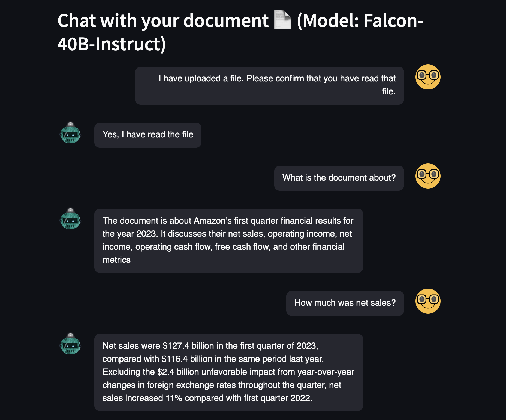
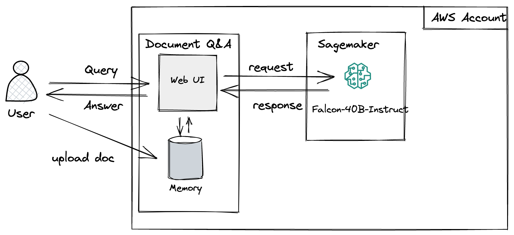

# falcon-document-chatbot
A repo for a document chatbot that uses the [Falcon](https://huggingface.co/tiiuae/falcon-40b-instruct) model



## Architecture diagram for SageMaker implementation
The key advantage with this implementation is that no data ever leaves your AWS account. The model is hosted in a SageMaker endpoint in your account and all inference requests will be sent to that endpoint.



## How to run the application locally
1. Install the required packages for this application with `pip install -r requirements.txt`. To avoid conflicts with existing python dependencies, it is best to do so in a virtual environment:   
  `$python3 -m venv .venv`    
  `$source .venv/bin/activate`  
  `$pip3 install -r requirements.txt`  
2. You will need a SageMaker endpoint with the Falcon model deployed in your account. If you don't have, one you can use this [notebook](deploy_falcon-40b-instruct.ipynb) to deploy it in your account.
3. (optional) Amend the [chatbot.py](chatbot.py) file so that it points to your endpoint (variable `endpoint_name`)
4. Run the app with `streamlit run chatbot.py`
5. Upload a text file (e.g. [Amazon's Q1 results](assets/amazon_q1_2023.txt))
6. Start chatting 🤗


## Running Streamlit apps in SageMaker Studio
If you want to run Streamlit apps directly in SM Studio, you can do so with command `streamlit run chatbot.py --server.port 6006`. Once the app has started you can go to `https://<YOUR_STUDIO_ID>.studio.<YOUR_REGION>.sagemaker.aws/jupyter/default/proxy/6006/` to launch the app.


## Running the app in a docker container
Another way to use this application is creating and running a docker image using the Dockerfile.

You can create the docker image with this command

```
docker build --tag chatbot_image .
```

Then you can run the application with the following command:

```
docker run -v ~/.aws:/root/.aws -p 8501:8501 chatbot_image
```
The flag -v allows you to bind mount your AWS credentials file from your host into the Docker container. This command tells Docker to mount the ~/.aws directory from your host machine into the /root/.aws directory in the Docker container. AWS SDKs will look for the credentials file in this location.

The format is -p <host_port>:<container_port>. If your application inside Docker listens on port 8501, for instance, and you want to access it via port 8501 on your host machine, you'd use -p 8501:8501.


**Access Your Application:**

If your Docker container is running a web application, you should now be able to access it in a web browser at localhost:8501 (or whatever host port you used).
